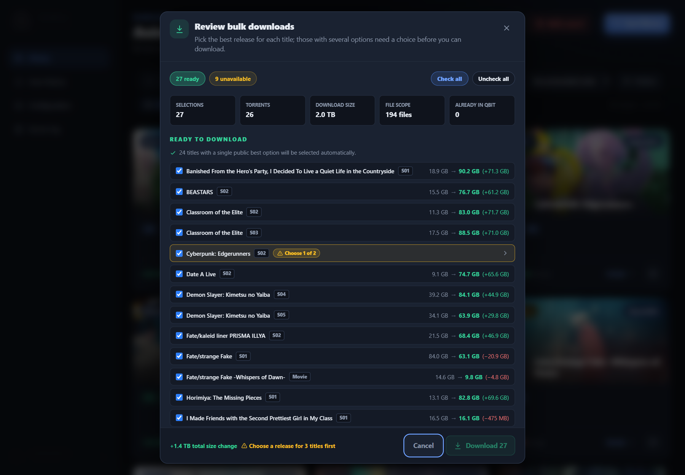
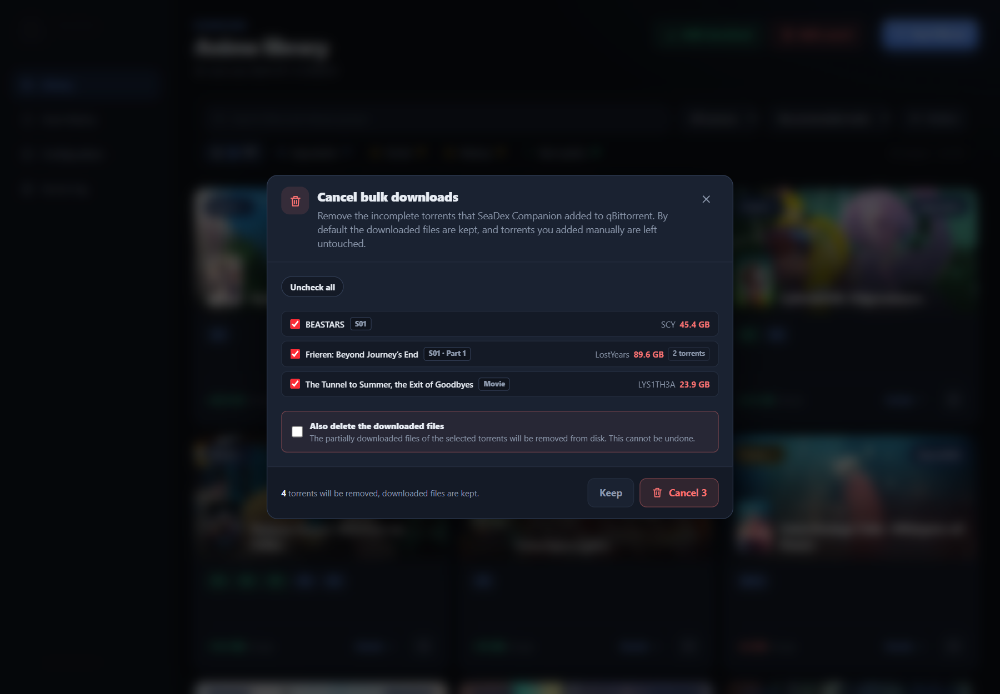
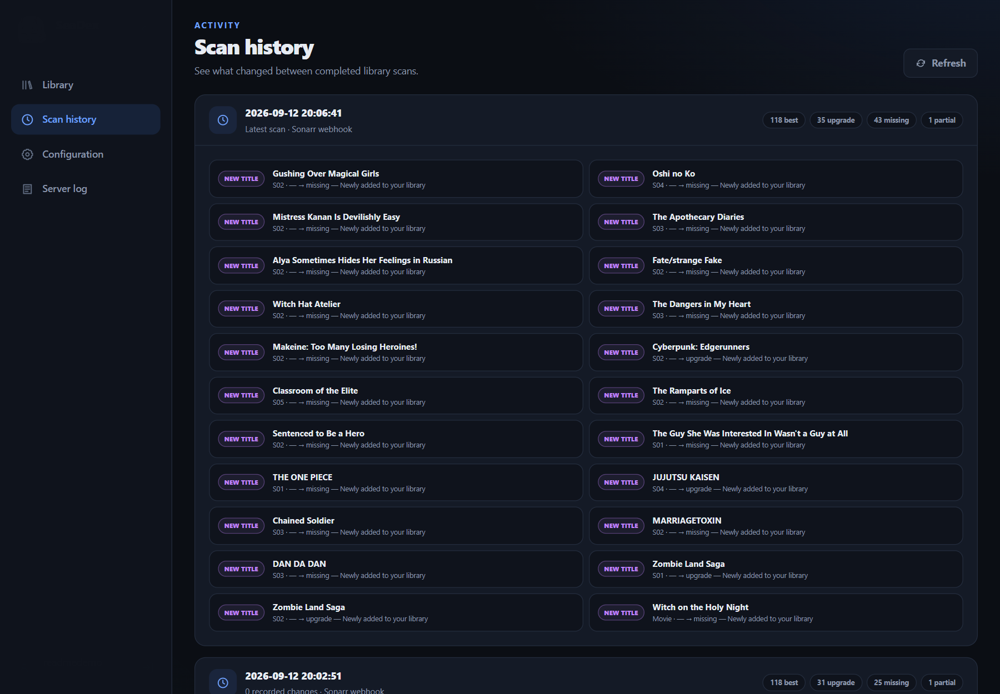
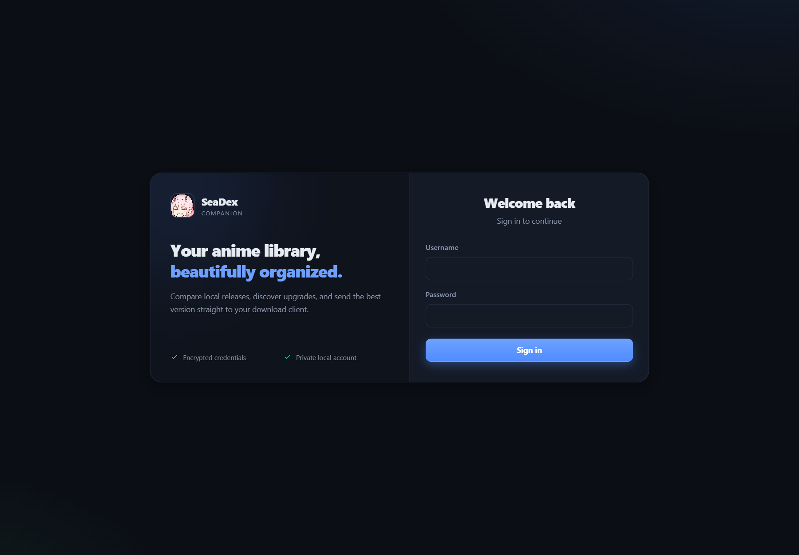

# SeaDex Companion

SeaDex Companion is a self-hosted web UI that compares your **Sonarr** and **Radarr** anime libraries with the best releases indexed by [SeaDex](https://releases.moe/). It highlights missing upgrades, explains the match season by season, and can send selected public releases directly to qBittorrent.

<p align="center">
  
</p>

> [!WARNING]
> This project is built and maintained as a personal, heavily AI-assisted project. It is tested with care, but you should review its configuration and behavior before relying on it.

## Highlights

- One card per anime, with all seasons grouped together
- Upgrade states for **Upgradable**, **Best quality**, **Partially on SeaDex**, and **Not on SeaDex**
- Episode-aware matching for split seasons, cours, and multi-part releases
- Current-size versus target-size comparison
- One-click or bulk downloads through qBittorrent, limited to missing episodes when possible
- Download monitoring, pause, resume, cancellation, and removal
- Search and filtering by title, release group, source, and status
- Manual AniList corrections and season/cour exclusions
- Interval, daily, or weekly scans with timezone and missed-run controls
- Sonarr and Radarr webhooks for incremental scans when titles are added
- Scan history, change feed, Discord notifications, and live server logs
- Password-protected UI, Argon2ID password hashing, session revocation, and AES-256-GCM credential encryption

## Quick start

### Docker

The published image is available from [Docker Hub](https://hub.docker.com/r/hiranaka/seadex-companion).

```bash
docker run -d \
  --name seadex-companion \
  --restart unless-stopped \
  -p 127.0.0.1:8080:8080 \
  -v seadex-data:/app/data \
  hiranaka/seadex-companion:latest
```

Open [http://localhost:8080](http://localhost:8080), create the administrator account, then configure your services under **Configuration**.

The named volume stores configuration, account data, the encryption key, caches, scan results, and logs. The container runs as an unprivileged user and exposes a health check at `/healthz`.

### Docker Compose

The included `docker-compose.yml` builds the current source:

```bash
docker compose up -d --build
```

For the published image instead, use:

```yaml
services:
  seadex-companion:
    image: hiranaka/seadex-companion:latest
    container_name: seadex-companion
    ports:
      - "127.0.0.1:8080:8080"
    volumes:
      - seadex-data:/app/data
    environment:
      - PORT=8080
      - DATA_DIR=/app/data
      - TZ=Europe/Berlin
    restart: unless-stopped

volumes:
  seadex-data:
```

Replace `TZ` with your [IANA timezone](https://en.wikipedia.org/wiki/List_of_tz_database_time_zones). Update a published-image deployment with:

```bash
docker compose pull && docker compose up -d
```

## Configuration

All integrations are configured in the WebUI; no integration credentials need to be passed through Docker.

1. Add a Sonarr URL and API key, a Radarr URL and API key, or both.
2. Add qBittorrent credentials to enable downloads.
3. Optionally add a Discord webhook for upgrade notifications.
4. Test each configured integration, save, and select **Scan library**.
5. Configure automatic scans under **Configuration → Automation**.

For near-real-time discovery, add these webhook connections in Sonarr and Radarr using HTTP Basic Authentication with your SeaDex Companion username and password:

- Sonarr: `https://your-seadex-host/api/webhooks/sonarr`
- Radarr: `https://your-seadex-host/api/webhooks/radarr`

SeaDex Companion accepts Sonarr `SeriesAdd` and Radarr `MovieAdded` events. Keep a scheduled scan enabled as well; scheduled scans reconcile existing titles when SeaDex changes older entries.

## Run from source

Requires **Node.js 24+**.

```bash
npm install
npm --prefix frontend install
npm start
```

For live reload, run these in separate terminals:

```bash
npm run dev
npm --prefix frontend run dev
```

The Vite development server proxies `/api` requests to the backend on port `8080`.

## Security

> [!IMPORTANT]
> SeaDex Companion is intended for a trusted home network. Do not expose port `8080` directly to the internet.

For remote access, prefer a private VPN. If you use a reverse proxy, require HTTPS and access controls, and forward `X-Forwarded-Proto: https` so session cookies are marked `Secure`.

- Use a unique administrator password.
- Keep the container and host patched.
- Do not grant untrusted users administrator access; configured integration URLs can reach private services on the application's network.
- Back up the persistent `seadex-data` volume before upgrades or host migration.

## Support and license

- Report defects through [GitHub Issues](https://github.com/hiranaka99/SeaDex-Companion/issues).
- Licensed under the [MIT License](LICENSE).

## Screenshots


### Release details


### Bulk download review



### Bulk cancellation




### Scan history



### Sign in


